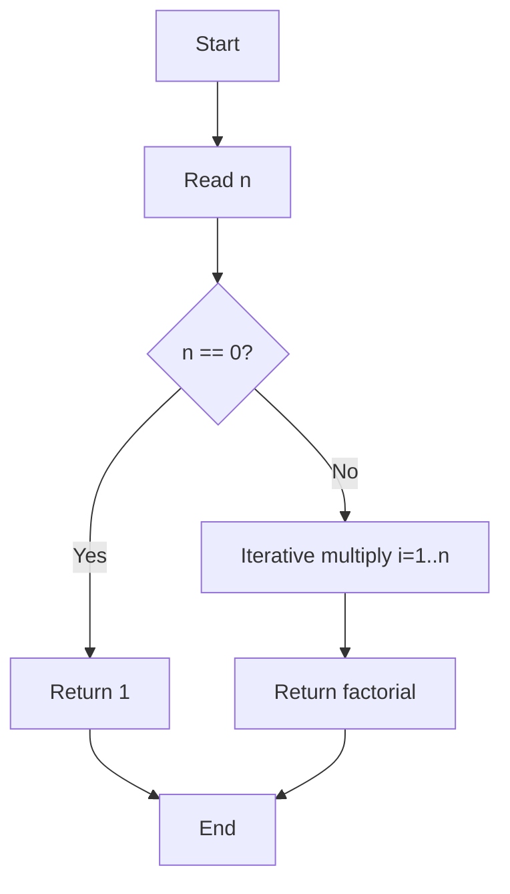
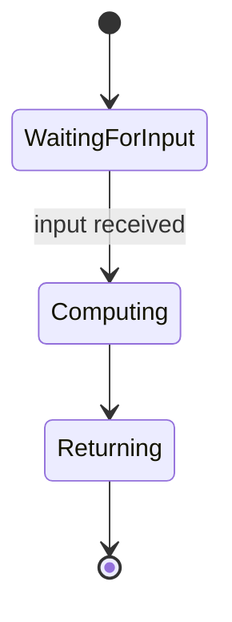
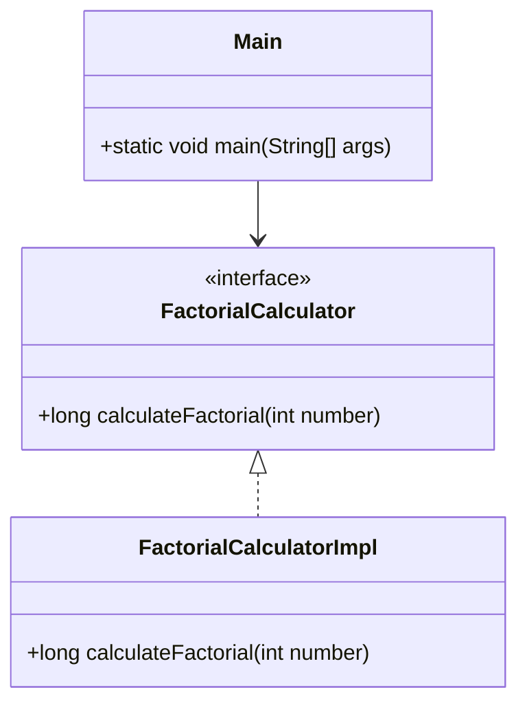

# Algorithm Lab 1 - Factorial Calculator

A simple Java application that calculates factorial values using an iterative approach.

## Project Overview

This is **Algorithm Laboratory Work 1, Task 1.3** for calculating factorials in Java. The project demonstrates basic factorial computation logic with a clean interface-based design.

## Factorial Logic

### Algorithm Description

The factorial of a non-negative integer `n` (denoted as `n!`) is the product of all positive integers less than or equal to `n`:

```
n! = n × (n-1) × (n-2) × ... × 2 × 1
```

**Special case:** `0! = 1`

### Implementation Details

The `FactorialCalculatorImpl` class implements an **iterative approach**:

```java
public long calculateFactorial(int number) {
    if (number == 0) {
        return 1;
    }

    long factorial = 1;
    int i = 1;
    while (i <= number) {
        factorial = factorial * i;
        i++;
    }

    return factorial;
}
```

**Key points:**
- **Base case:** Returns `1` for input `0`
- **Iterative loop:** Multiplies all integers from 1 to `n`
- **Return type:** `long` to handle larger factorial values
- **Time complexity:** O(n)
- **Space complexity:** O(1)

### Example

```
calculateFactorial(5) = 5 × 4 × 3 × 2 × 1 = 120
calculateFactorial(0) = 1
calculateFactorial(10) = 3,628,800
```

## Project Structure

```
alg-lb1/
├── pom.xml                     # Maven configuration
├── Makefile                    # Build commands
├── README.md                   # This file
├── .mvn/                       # Maven Wrapper
└── src/
    ├── main/java/com/lpnu/alg_lb1/
    │   ├── FactorialCalculator.java       # Interface
    │   ├── FactorialCalculatorImpl.java    # Implementation
    │   └── Main.java                      # Entry point
    └── test/java/com/lpnu/alg_lb1/
        └── FactorialTest.java             # Unit tests
```

## Build & Run

### Prerequisites

- Java 21+
- Maven (or use the included Maven Wrapper)

### Commands

```bash
# Run tests
make test

# Run the application
make run

# Install Maven Wrapper (utility command)
make install-mvnw

# View all available commands
make help
```

## Dependencies

- **JUnit Jupiter 5.11.0** - For unit testing

## Usage

```java
FactorialCalculator calculator = new FactorialCalculatorImpl();
long result = calculator.calculateFactorial(10);
System.out.println(result);  // Output: 3628800
```

## Diagrams

### Flowchart (algorithm)



### Activity (state) diagram



### Structural Diagram (classDiagram)



## License

This is an academic laboratory assignment.
