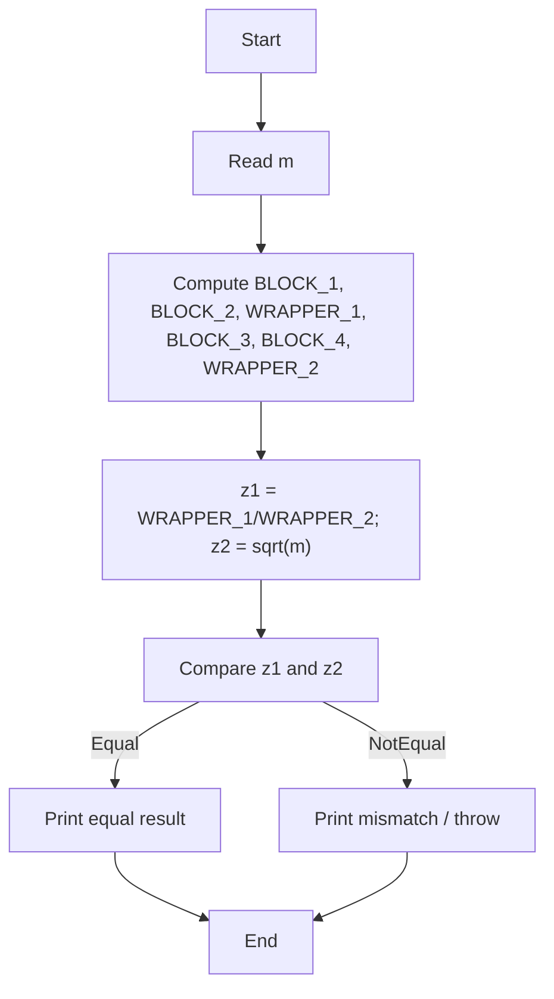
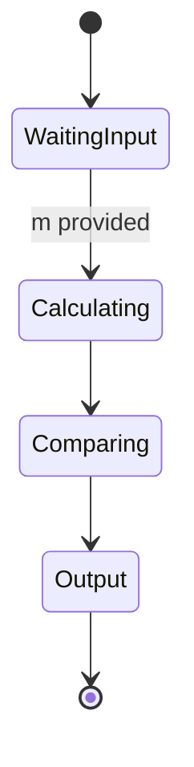
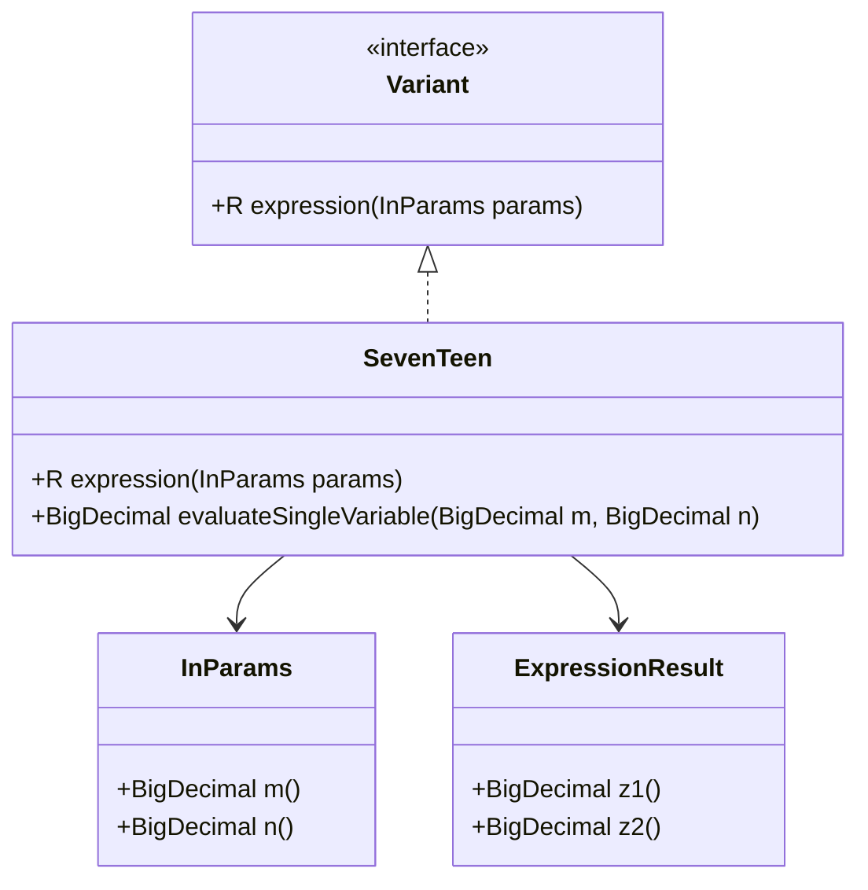

# Algorithm Lab 2 - Variant 17 Expression Evaluation

This project implements a Java program for calculating a mathematical expression based on a given input parameter `m`. The solution follows the laboratory assignment requirements and validates that two equivalent expressions produce the same numerical result within a small tolerance.

## Project Overview

This is the second algorithm laboratory work, where the task is to implement a program that evaluates a variant-specific formula and prints the results of two mathematically equivalent expressions:

- `z1`
- `z2`

The implementation is organized around a `Variant` interface and a concrete class `SevenTeen`, which calculates the expression for variant number 17.

## Mathematical Formula

From the code in `src/main/java/com/lpnu/alg_lb2/var/SevenTeen.java`, the following calculations are performed:

```text
BLOCK_1 = (3m + 2)^2
BLOCK_2 = 24m
WRAPPER_1 = sqrt(BLOCK_1 - BLOCK_2)

BLOCK_3 = 3 * sqrt(m)
BLOCK_4 = 2 / sqrt(m)
WRAPPER_2 = BLOCK_3 - BLOCK_4

z2 = sqrt(m)
z1 = WRAPPER_1 / WRAPPER_2
```

Therefore, the expression can be written as:

```text
z1 = sqrt((3m + 2)^2 - 24m) / (3 * sqrt(m) - 2 / sqrt(m))
z2 = sqrt(m)
```

Simplifying the numerator:

```text
(3m + 2)^2 - 24m = 9m^2 - 12m + 4 = (3m - 2)^2
```

and the denominator:

```text
3 * sqrt(m) - 2 / sqrt(m) = (3m - 2) / sqrt(m)
```

Thus for `m > 2/3`, we obtain:

```text
z1 = sqrt((3m - 2)^2) / ((3m - 2) / sqrt(m)) = sqrt(m)
```

So the program checks the equivalence:

```text
z1 = z2
```

which is exactly what the JUnit test verifies with a small epsilon margin.

## Implementation Details

The main logic is located in `SevenTeen.java`:

```java
var BLOCK_1 = THREE.multiply(params.m()).add(BigDecimal.TWO).pow(2);
var BLOCK_2 = BigDecimal.valueOf(24).multiply(params.m());
var WRAPPER_1 = BLOCK_1.subtract(BLOCK_2).sqrt(mc);

var BLOCK_3 = params.m().sqrt(mc).multiply(THREE);
var BLOCK_4 = BigDecimal.TWO.divide(params.m().sqrt(mc), mc);
var WRAPPER_2 = BLOCK_3.subtract(BLOCK_4);

var z2 = params.m().sqrt(mc);
return new ExpressionResult(WRAPPER_1.divide(WRAPPER_2, mc), z2);
```

### Notes

- The project uses `BigDecimal` to preserve numerical accuracy for decimal and square-root calculations.
- The `MathContext.DECIMAL128` precision setting reduces rounding errors.
- The test generates random values of `m` in the range `[1.0, 2.0)` and compares `z1` and `z2` with a tolerance.

## Project Structure

```text
alg-lb1/
├── pom.xml
├── Makefile
├── README.md
├── lb2/
│   ├── pom.xml
│   ├── README.md
│   └── src/
│       ├── main/java/com/lpnu/alg_lb2/
│       │   ├── InParams.java
│       │   ├── InputLine.java
│       │   ├── Main.java
│       │   ├── Variant.java
│       │   └── var/
│       │       └── SevenTeen.java
│       └── test/java/com/lpnu/alg_lb2/
│           └── ExpressionTest.java
```

## Build and Run

### Prerequisites

- Java 21+
- Maven or Maven Wrapper

### Commands

```bash
# Run all tests for the project
make test

# Run tests for lab 2 only
make test-lb2

# Run the lab 2 program
make run LAB=lb2
```

## Example

When the program is executed, it asks for the input values and computes the results for `z1` and `z2`. The output is printed in the console, and the test verifies that the difference between both values stays below a small tolerance.

## Academic Purpose

This laboratory work demonstrates:

- working with numerical calculations in Java,
- using `BigDecimal` for precision-sensitive computations,
- implementing formula-based logic in a modular structure,
- validating mathematical equivalence in unit tests.

## Diagrams

### Flowchart (algorithm)



### Activity (state) diagram



### Structural Diagram (classDiagram)



## License

This is an academic laboratory assignment.
