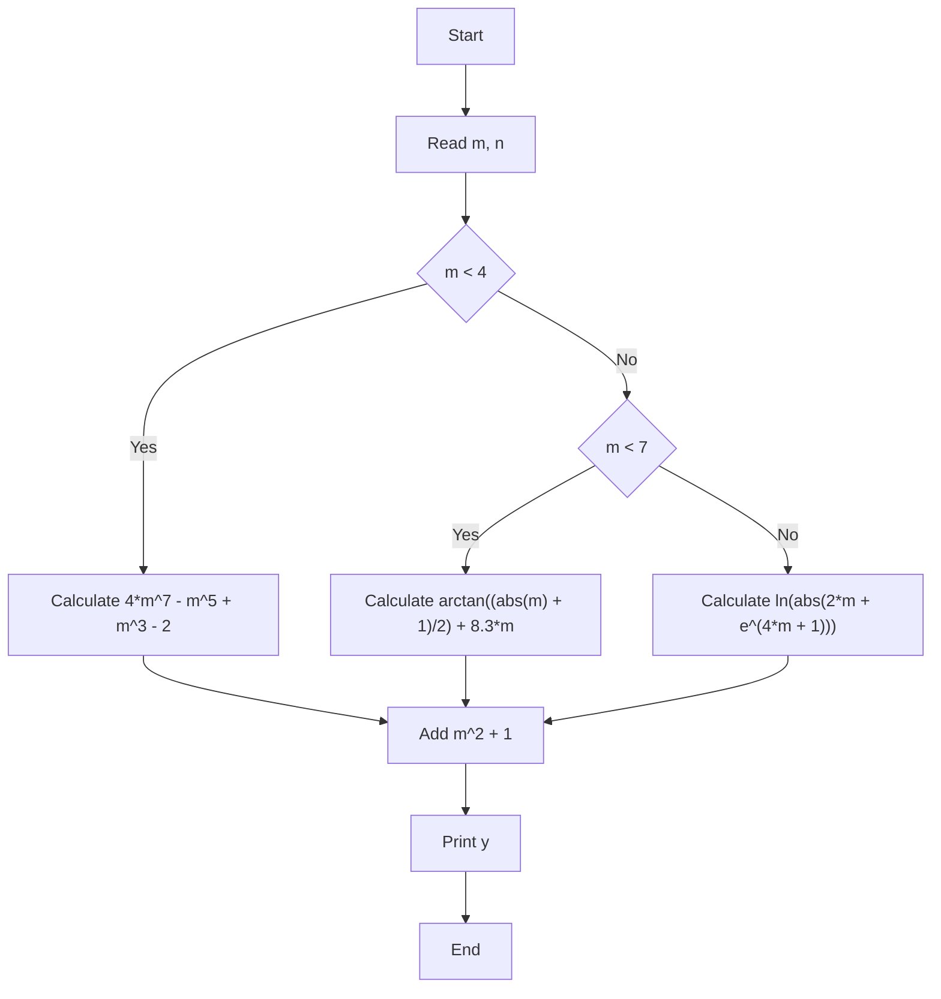
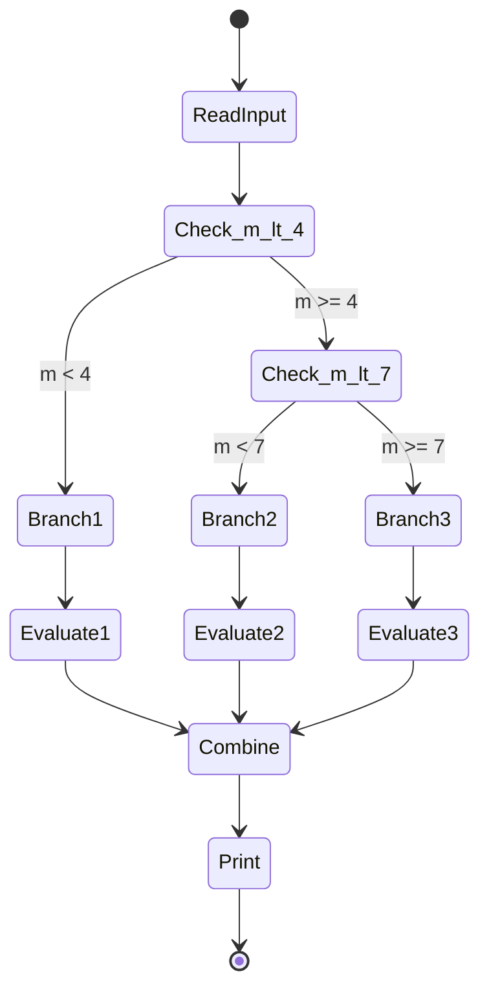
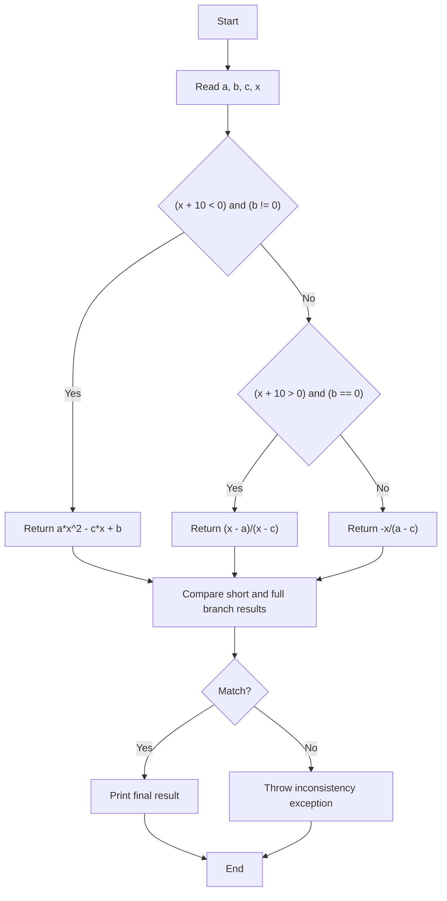
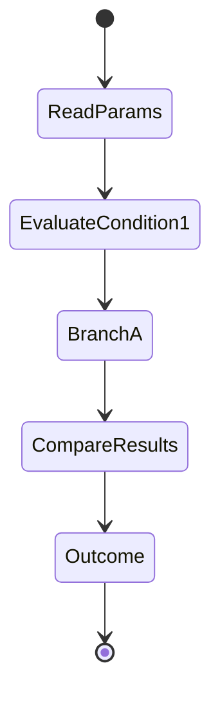
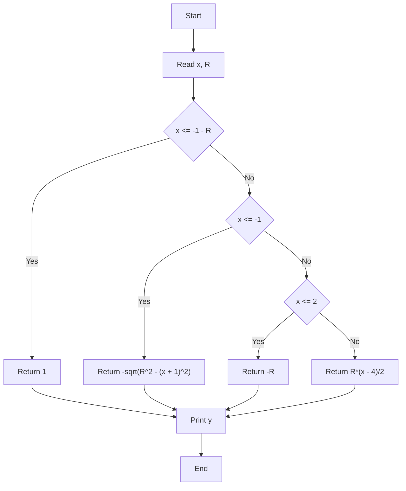
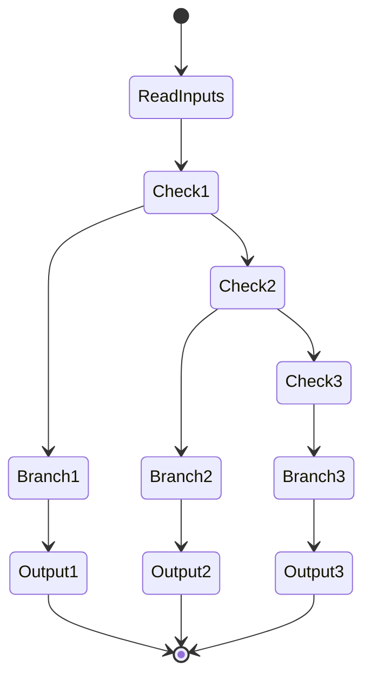
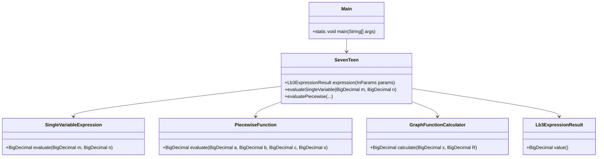

# LB3 — Variant 17

This laboratory work contains three separate tasks combined in a single CLI application launched from `Main`. Each task is implemented in a dedicated package to make the structure clearer and easier to maintain.

## Project structure

- `var/task1` — Task 1: single-variable function evaluation
- `var/task2` — Task 2: piecewise function `F(x)`
- `var/task3` — Task 3: graph-defined function `y = f(x)`
- `Main.java` — entry point that reads inputs for all tasks and prints labeled results

## Architecture diagrams

### Task 1 — flowchart

### Task 1 — UML activity diagram

### Task 2 — flowchart

### Task 2 — UML activity diagram

### Task 3 — flowchart

### Task 3 — UML activity diagram

## Task 1 — Single-variable function

Input values: `m`, `n`

The function is built as:

$$Y = m^2 + 1 + \Phi(m)$$

where the branch logic is:

$$\Phi(m) = \begin{cases} 4m^7 - m^5 + m^3 - 2, & m < 4 \\ \arctan\left(\frac{\vert{}m\vert{} + 1}{2}\right) + 8.3m, & 4 \le m < 7 \\ \ln\left(\vert{}2m + e^{4m + 1}\vert{}\right), & m \ge 7 \end{cases}$$

Implementation: `SingleVariableExpression` in package `com.lpnu.alg_lb3.var.task1`.

## Task 2 — Piecewise function `F(x)`

Input values: `a`, `b`, `c`, `x`

The function is implemented in both short and full conditional forms, and the two results are checked for equality:

$$F(x) = \begin{cases} ax^2 - cx + b, & x + 10 < 0 \ \text{and } b \ne 0 \\ \dfrac{x - a}{x - c}, & x + 10 > 0 \ \text{and } b = 0 \\ -\dfrac{x}{a - c}, & \text{otherwise} \end{cases}$$

Implementation: `PiecewiseExpression`, `ShortFormExpression`, `FullFormExpression`, `PiecewiseFunction`, and `SevenTeen` in package `com.lpnu.alg_lb3.var.task2`.

## Task 3 — Graph-defined function `y = f(x)`

Input values: `x`, `R`

The graph is divided into the following branches:

$$y = \begin{cases} 1, & x \le -1 - R \\ -\sqrt{R^2 - (x + 1)^2}, & -1 - R < x \le -1 \\ -R, & -1 < x \le 2 \\ \dfrac{R(x - 4)}{2}, & x > 2 \end{cases}$$

Implementation: `GraphFunctionCalculator` in package `com.lpnu.alg_lb3.var.task3`.

### Structural Diagram (classDiagram)

## How the project is implemented

* `Main.java` reads all required input values for all three tasks
* each task has its own dedicated logic module
* Task 3 adds clear labels in the output: `Task 1`, `Task 2`, `Task 3`
* branching is implemented using the full `if / else if / else` structure

This is Laboratory Work 3, Variant 17, implemented in a structured OOP style with clear responsibility separation between classes.
