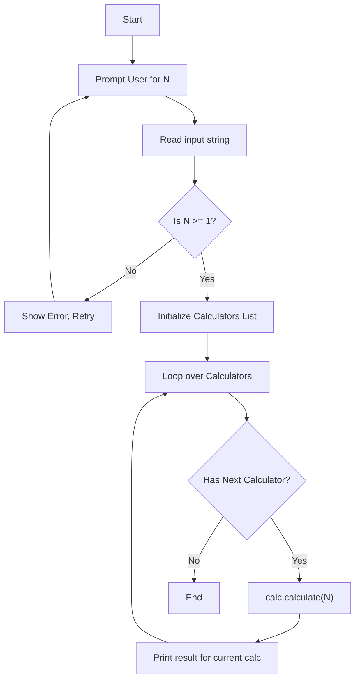
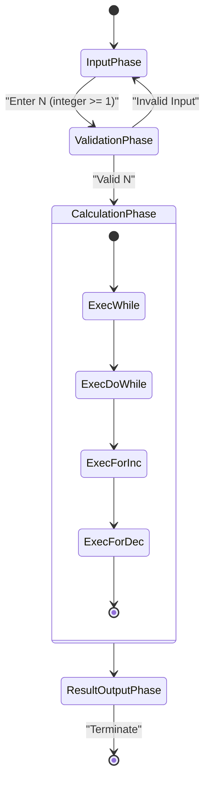
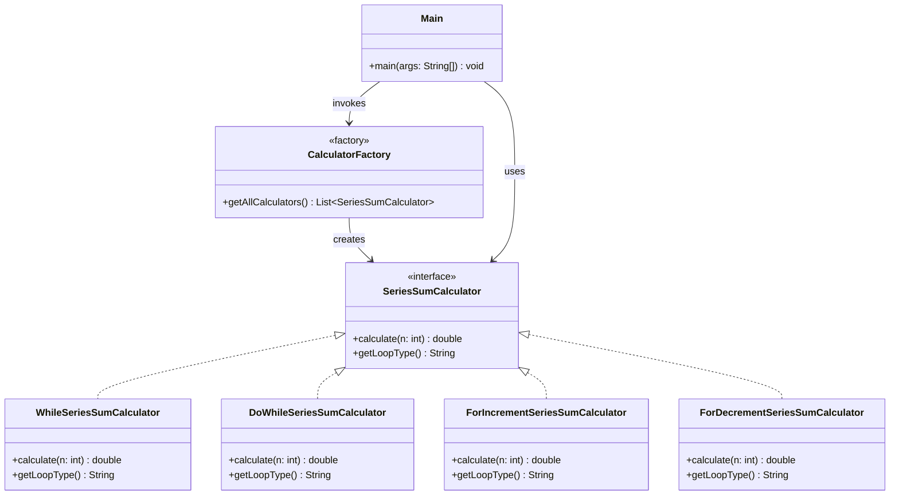

# Lab 4: Trigonometric Series Sum Calculation

## 1. Task Description
The goal of this module is to compute the finite sum of a trigonometric expression using four different looping constructions available in Java (`while`, `do-while`, `for` incrementing, `for` decrementing). The mathematical expression is:

$$ S = \sum_{i=1}^{N} \frac{\sin i}{1+\cos i} $$

The program queries the user for a single integer input `N` (upper limit of summation where `N >= 1`), computes the sum using all four looping strategies, and prints exactly four lines with the results. All four outputs must match precisely, thereby proving algorithmic equivalence of the loop constructs.

## 2. Execution Guide
To run this laboratory job from the root directory:
```bash
# Compile tests and build the main artifact
mvn clean package

# Or execute only the specific module test
mvn test -pl lb4

# Run the user interface
java -cp lb4/target/classes:common-utils/target/classes com.lpnu.lb4.ui.Main
```

## 3. Diagrams

### Flowchart: Algorithmic Logic


### UML Activity Diagram: Execution Flow


### Structural Class Diagram: Architecture

