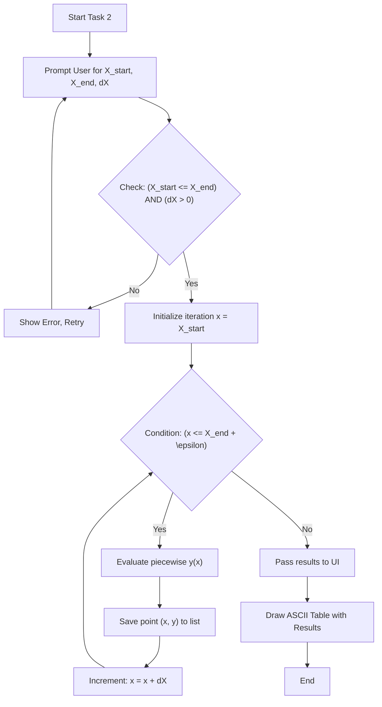
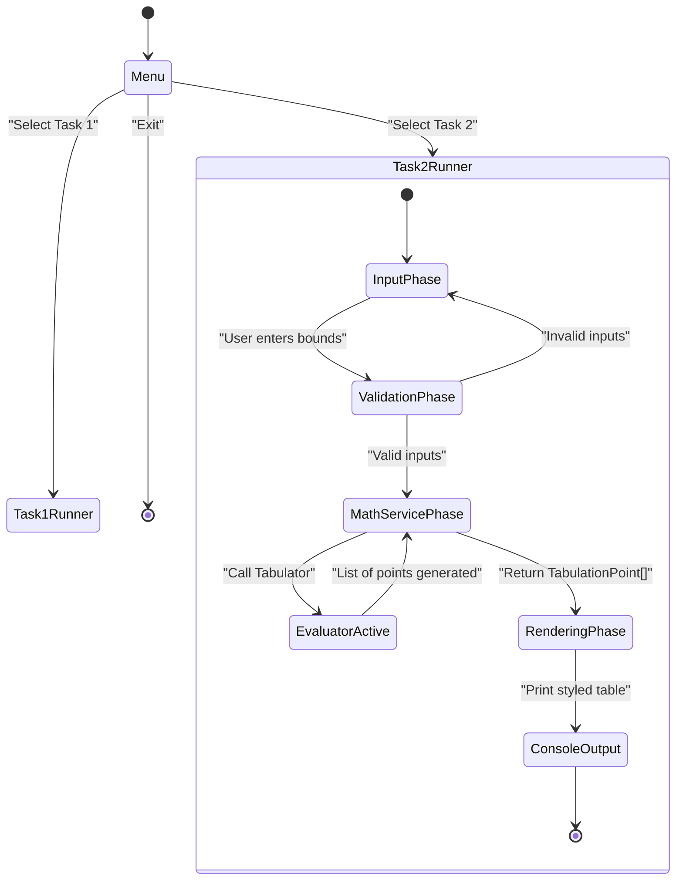
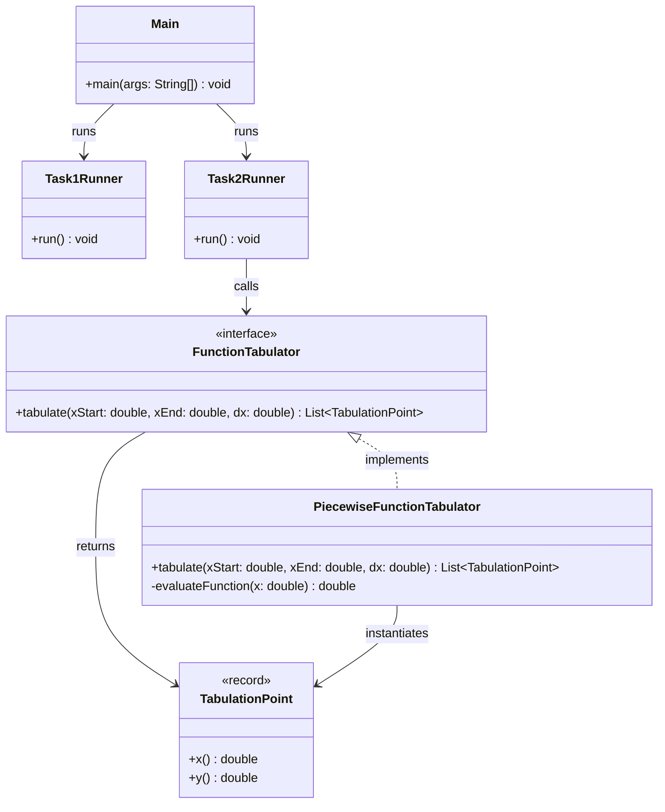

# Lab 4: Loop Constructs and Function Tabulation

## 1. Task Description

This lab contains multiple sub-tasks demonstrating correct usage of loop constructions and separation of concerns via the Contract pattern.

**Task 1: Trigonometric Series Sum**
Computes the finite sum of a trigonometric expression using four different looping constructions available in Java (`while`, `do-while`, `for` incrementing, `for` decrementing).
$$ S = \sum_{i=1}^{N} \frac{\sin i}{1+\cos i} $$

**Task 2: Piecewise Function Tabulation**
Tabulates a piecewise function over a user-defined interval $[X_{start}, X_{end}]$ with a defined step $dX$. The function is defined as:
$$ y = x^2 + 1 + f(x) $$
Where $f(x)$ conditionally splits into:
* $4x^2 - x^2 + x^2 - 2 \quad \text{for } x < 4$
* $\sin(2x + 1) \quad \text{for } 4 \le x < 7$
* $\ln(2x + e^{x+1}) \quad \text{for } x \ge 7$

The algorithm loops through the interval safely avoiding precision drop, evaluates the mathematical contract, and formats the output into an ASCII-rendered geometric table.

## 2. Execution Guide
To run this laboratory job from the root directory:
```bash
# Compile tests and build the main artifact
mvn clean package

# Run the user interface (interactive menu)
java -cp lb4/target/classes:common-utils/target/classes com.lpnu.lb4.ui.Main
```

## 3. Diagrams

### Flowchart: Task 2 Tabulation logic


### UML Activity Diagram: Execution Flow


### Structural Class Diagram: Architecture

**Task 3: Parametric Function Tabulation**
Tabulates a function that depends on the argument $x$ and three parameters $a, b, c$.
$$F(x, a, b, c) = \begin{cases} a x^3 - (x+b), & \text{if } x+10 < 0 \text{ and } b = 0 \\ \frac{x-a}{x-c}, & \text{if } x+10 > 0 \text{ and } b = 0 \\ \frac{x-c}{a-c}, & \text{otherwise} \end{cases}$$
The application evaluates complex logical composite statements for branch selection inside loops and securely outputs formatted ASCII table checking edge cases (e.g. division by zero).

