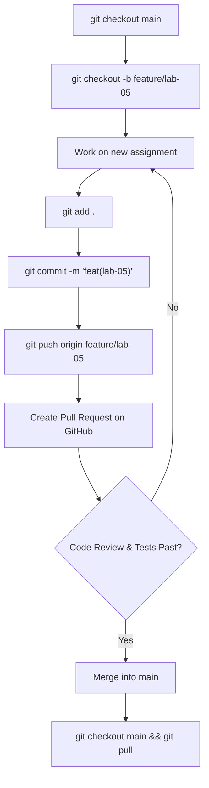
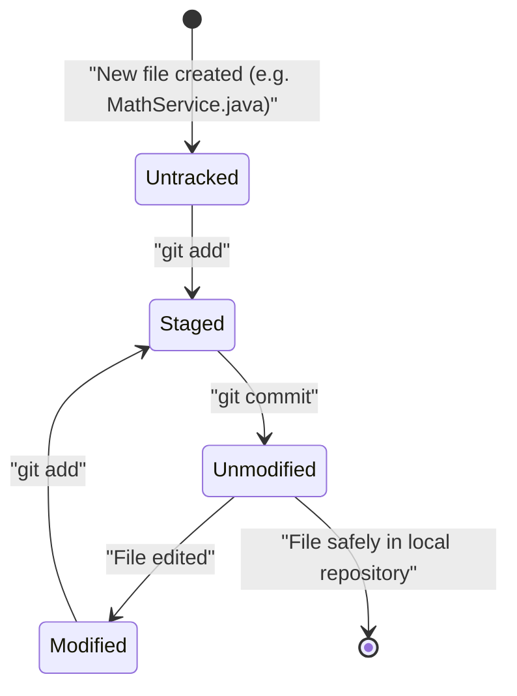
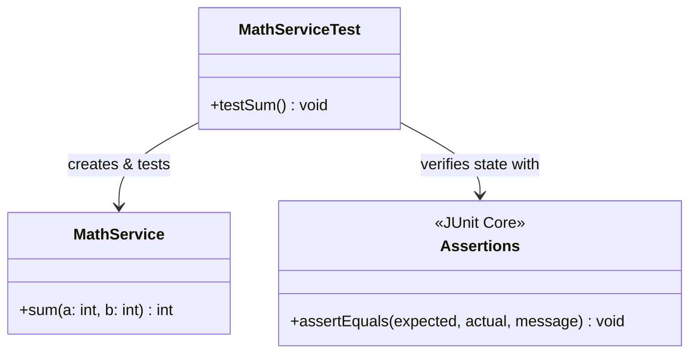

# Lab 5: Version Control and Unit Testing (Task 5.0)

## 1. Task Description
This laboratory module aims to demonstrate the fundamentals of version control using Git, cloud repository hosting via GitHub, and automated Unit Testing. The module specifically focuses on setting up isolated branches (`feature/lab-05`), writing a trivial testing method, and confirming functionality using test assertion libraries (`JUnit - Assertions.assertEquals()`).

## 2. Execution Guide
To run tests and confirm that the environment is fully functional:
```bash
# Compile tests and build the main artifact
mvn clean test -pl lb5
```

## 3. Diagrams

### Flowchart: Git Branching & Merging Flow


### UML Activity Diagram: File States in Git


### Structural Class Diagram: Unit Testing Architecture

**Task 5.1: Custom Math Functions**
Demonstrates modular decomposition mapping a mathematical component $h(x, y, z)$ into an isolable programmatic function block to resolve composite expressions.
Formula:
$$\frac{h(a,b,1) + h(1,a,b)}{1 + h(a^2 + b^2, 1, 0)}$$
where
$$h(x, y, z) = \frac{x + y + z}{x^2 + y^2 + z^2}$$


**Task 5.2: Taylor Series Modular Functions**
Refactors the mathematical infinite series logic strictly into disjoint helper routines, optimizing operations through Recurrent Relations (where $a_n = a_{n-1} \cdot R$). The logic has been completely encapsulated into Java `common-utils` making it a shared library across the entire enterprise context (demonstrating cross-module functionality reuse). Output structures mimicking pass-by-reference tuples return multiple parallel states successfully.


**Task 5.3: Piecewise Functions and Recurrent Loops**
Aggregates independent math execution patterns (piecewise functional branching and optimized recurrent loop accumulation) inside one overarching layout. Calculates an outer formula composed of dynamic $h(x)$ resolutions, which internally determines its execution branch based on module bounds $|x| \ge 1$ vs $|x| < 1$.


**Task 5.4: Summation using Recursion 5 ways**
Models iterative evaluation techniques fundamentally through call stack hierarchies across five contrasting flows.
Equation:
$$S = \sum_{j=2}^{N} \frac{j(N - j)}{j^2 + (N - j)^2}$$
- Recursion evaluating through tree **Descent** (Forward Accumulation) using ascending and descending steps.
- Recursion evaluating through tree **Ascent** (Forward Return) using ascending and descending steps.
- Standard benchmark loop for delta equality checking.

