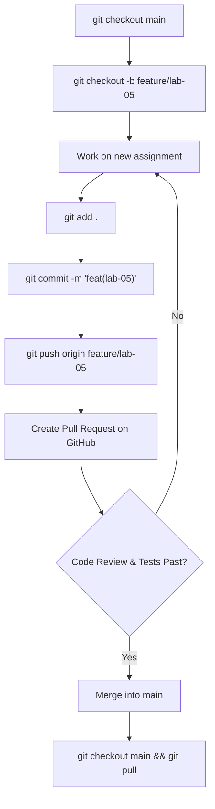
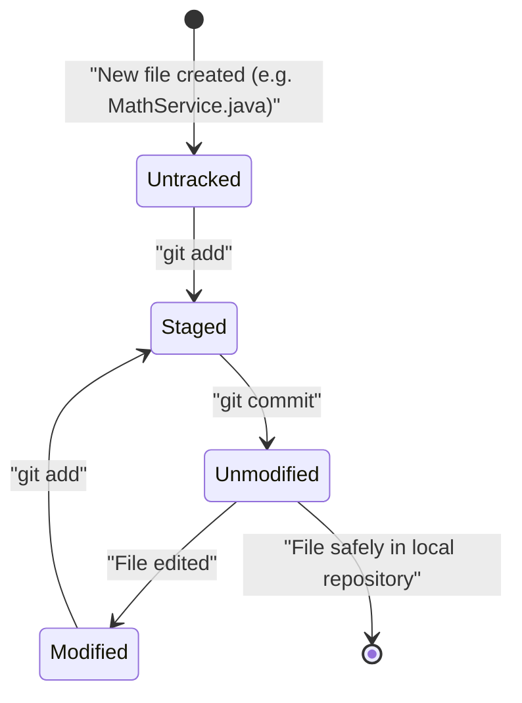
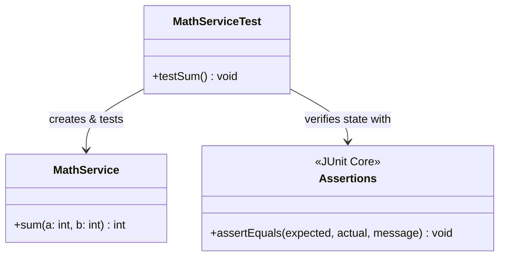

# Lab 5: Version Control and Unit Testing (Task 5.0)

## 1. Task Description
This laboratory module aims to demonstrate the fundamentals of version control using Git, cloud repository hosting via GitHub, and automated Unit Testing. The module specifically focuses on setting up isolated branches (`feature/lab-05`), writing a trivial testing method, and confirming functionality using test assertion libraries (`JUnit - Assertions.assertEquals()`).

## 2. Execution Guide
To run tests and confirm that the environment is fully functional:
```bash
# Compile tests and build the main artifact
mvn clean test -pl lb5
```

## 3. Diagrams

### Flowchart: Git Branching & Merging Flow


### UML Activity Diagram: File States in Git


### Structural Class Diagram: Unit Testing Architecture
